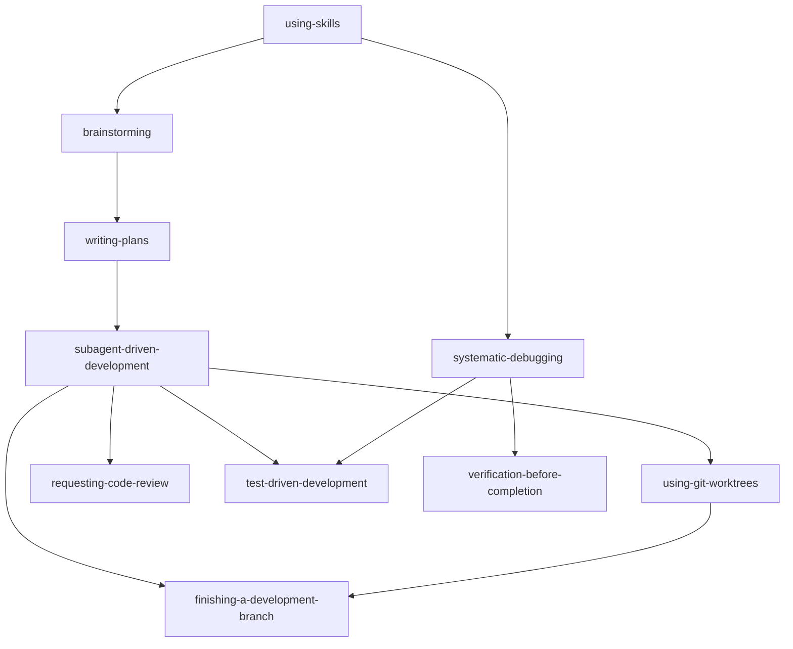

# pi-skills

A personal skills library for [pi](https://github.com/badlogic/pi-mono/tree/main/packages/coding-agent). The skills use pi tool names and pi workflows only.

## Installation

Clone into a subdirectory of pi's global skills location:

```bash
git clone https://github.com/fgladisch/pi-skills.git ~/.agents/skills/pi-skills
```

Or use pi's dedicated location (also as a subdirectory):

```bash
git clone https://github.com/fgladisch/pi-skills.git ~/.pi/agent/skills/pi-skills
```

For local development, you can symlink the `skills/` directory into pi's global skills path:

```bash
mkdir -p ~/.pi/agent/skills
ln -s ~/code/pi-skills/skills ~/.pi/agent/skills/pi-skills
```

## Skills

| Skill                            | When to use                                                                                                                                                                                           |
| -------------------------------- | ----------------------------------------------------------------------------------------------------------------------------------------------------------------------------------------------------- |
| `brainstorming`                  | Before any creative work — explores intent, requirements, and design before implementation (uses [`@fgladisch/pi-user-select`](https://www.npmjs.com/package/@fgladisch/pi-user-select))              |
| `commit`                         | When the user asks to commit changes — creates git commits following the gitmoji convention (uses [`@fgladisch/pi-user-select`](https://www.npmjs.com/package/@fgladisch/pi-user-select))             |
| `dispatching-parallel-agents`    | When facing 2+ independent tasks that can run without shared state (uses [`pi-subagents`](https://github.com/nicobailon/pi-subagents))                                                                |
| `finishing-a-development-branch` | When implementation is complete and ready for merge / PR / cleanup                                                                                                                                    |
| `grill-me`                       | When user wants to stress-test a plan, get grilled on their design, or mentions "grill me" (uses [`@fgladisch/pi-user-select`](https://www.npmjs.com/package/@fgladisch/pi-user-select))              |
| `receiving-code-review`          | When receiving code review feedback, before implementing suggestions                                                                                                                                  |
| `requesting-code-review`         | When completing tasks or major features, before merging (uses [`pi-subagents`](https://github.com/nicobailon/pi-subagents))                                                                           |
| `simplify`                       | After making code changes, before committing — reviews the diff for reuse, quality, and efficiency in parallel and fixes findings (uses [`pi-subagents`](https://github.com/nicobailon/pi-subagents)) |
| `subagent-driven-development`    | When executing implementation plans with independent tasks in the current session (uses [`pi-subagents`](https://github.com/nicobailon/pi-subagents))                                                 |
| `systematic-debugging`           | When encountering any bug, test failure, or unexpected behavior                                                                                                                                       |
| `test-driven-development`        | When implementing any feature or bugfix                                                                                                                                                               |
| `using-git-worktrees`            | When starting feature work that needs isolation from the current workspace                                                                                                                            |
| `using-skills`                   | When starting any conversation — establishes how to find and use pi skills                                                                                                                            |
| `verification-before-completion` | Before claiming work is complete, fixed, or passing                                                                                                                                                   |
| `writing-plans`                  | When you have a spec or requirements for a multi-step task                                                                                                                                            |
| `writing-skills`                 | When creating or editing skills                                                                                                                                                                       |

## Skill dependency graph



## Required extensions

Some skills depend on extension-provided tools. Install these before using the related skills:

| Extension                                                                              | Tool(s) provided | Required by skills                                                                                                   |
| -------------------------------------------------------------------------------------- | ---------------- | -------------------------------------------------------------------------------------------------------------------- |
| [`@fgladisch/pi-user-select`](https://www.npmjs.com/package/@fgladisch/pi-user-select) | `user_select`    | `brainstorming`, `commit`, `grill-me`                                                                                |
| [`pi-subagents`](https://github.com/nicobailon/pi-subagents)                           | `subagent`       | `dispatching-parallel-agents`, `requesting-code-review`, `simplify`, `subagent-driven-development`, `writing-skills` |

## Pi-specific notes

- Project context lives in `AGENTS.md`, pi's preferred project-instructions file.
- Verify `subagent` setup with `subagent({ action: "doctor" })`.
- Skills use pi tools directly: `read`, `write`, `edit`, `bash`, and extension tools when installed.

## License

MIT — see [LICENSE](LICENSE).
