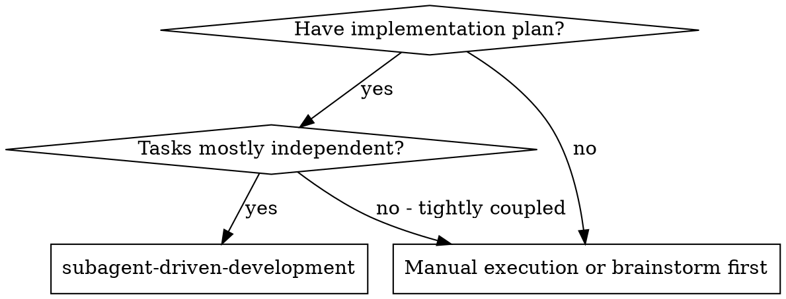
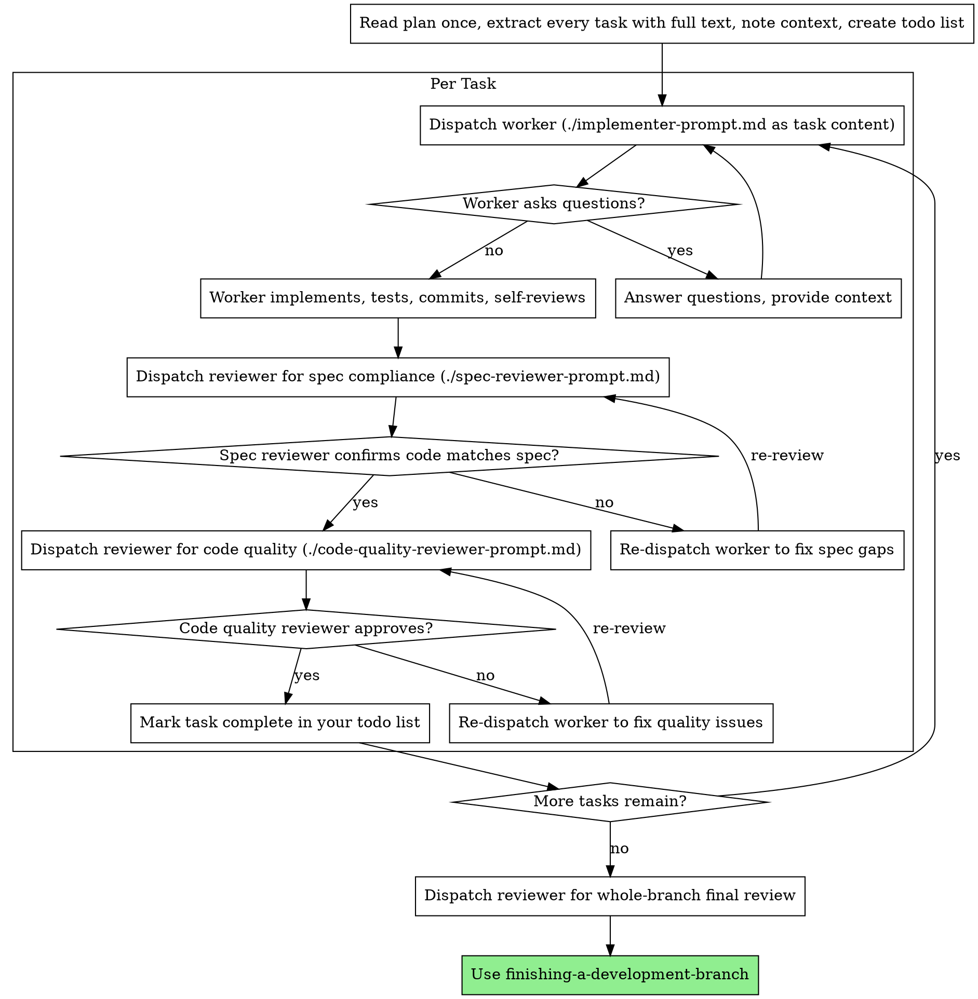

# Subagent-Driven Development

Execute a plan by dispatching one fresh subagent per task with the
[`pi-subagents`](https://github.com/nicobailon/pi-subagents) extension, then
gating each task on a two-stage review (spec compliance, then code quality).

**Why subagents:** You delegate tasks to specialized agents with isolated
context. By precisely crafting their instructions and selecting the right
context mode, you ensure they stay focused and succeed at their task. They
should never inherit your session's history unless you explicitly ask for it
— you construct exactly what they need. This also preserves your own context
for coordination work.

**Core principle:** Fresh subagent per task + two-stage review (spec then quality) = high quality, fast iteration.

> **Prerequisite:** the [`pi-subagents`](https://github.com/nicobailon/pi-subagents) extension must be installed. If `subagent({ action: "doctor" })` reports a healthy setup, you are ready. Read the `pi-subagents` skill for the full tool surface; this skill assumes its calling conventions.

## When to Use



**Why this workflow:**
- Fresh subagent per task (no context pollution)
- Two-stage review after each task: spec compliance first, then code quality
- Fast iteration with quality gates

## Agent Selection

`pi-subagents` ships with builtin agents. Use them rather than crafting one-off
generic delegates:

| Role | Builtin agent | Why |
|------|---------------|-----|
| Implementer | `worker` | General implementation; edits code directly; follows TDD |
| Spec compliance reviewer | `reviewer` | Adversarial review; explicitly constrained in the task to **report only, do not edit** |
| Code quality reviewer | `reviewer` | Same agent, second invocation, different prompt |
| Final branch reviewer | `reviewer` | Reviews the whole branch after all tasks land |

If the task is unusually mechanical or unusually deep, override the model per
call (`model: "..."`) or via `~/.pi/agent/settings.json`'s `subagents.agentOverrides`.
See the `pi-subagents` skill for override details.

> **Do not use `oracle` here.** `oracle` is forked-context advisory, not
> fresh-context adversarial review — it would inherit this session's history
> and lose its independence. Use it only when explicitly auditing inherited
> direction (e.g., during brainstorming), not for per-task review.

## Context Mode

Always dispatch with **`context: "fresh"`** (the default). Reasons:
- Implementers should not inherit the controller's noise — only the task text and scene-setting you paste in.
- Reviewers must be adversarial; `context: "fork"` would inherit the controller's bias.

The only place `context: "fork"` belongs in this workflow is when the
controller itself wants to consult `oracle` mid-flight about an architectural
question — and that's outside the per-task loop.

## The Process



## Dispatch Calls

### Implementer

```typescript
subagent({
  agent: "worker",
  task: `<full implementer-prompt.md content with task fields filled in>`,
  context: "fresh"
})
```

The `task` string is the entire content of `./implementer-prompt.md` after you
substitute the placeholders (`[Task N]`, `[FULL TEXT of task from plan]`,
`[Context]`, `[directory]`). The worker does not read the plan file — you
paste the task text directly so the worker has zero discovery overhead.

### Spec Compliance Reviewer

After the worker reports DONE, capture the head SHA and dispatch:

```typescript
subagent({
  agent: "reviewer",
  task: `<full spec-reviewer-prompt.md content with task + worker report filled in>`,
  context: "fresh"
})
```

The reviewer prompt explicitly forbids edits. Findings only.

### Code Quality Reviewer

Only after spec compliance passes:

```typescript
subagent({
  agent: "reviewer",
  task: `<full code-quality-reviewer-prompt.md content with task + SHAs + diff summary>`,
  context: "fresh"
})
```

### Re-dispatch on Review Findings

When either reviewer reports issues, re-dispatch the **worker** (not the
reviewer) with the original task content prefixed by:

```text
You previously implemented this task. The reviewer found these issues:

[paste reviewer's findings verbatim]

Fix exactly these issues. Do not redo the rest. Then commit and report back.
```

After the worker reports DONE again, re-dispatch the same reviewer (spec or
quality) with the updated SHAs. Loop until that reviewer approves.

### Final Branch Review

After every task is approved, run one whole-branch review:

```typescript
subagent({
  agent: "reviewer",
  task: `Final review of the entire ${branch} branch against ${plan-path}.
         Inspect every commit since ${base-sha}. Verify all spec acceptance
         criteria are met. Report a single Strengths / Issues / Assessment block.`,
  context: "fresh"
})
```

If the final reviewer flags blockers, route them back through the appropriate
task's worker. Otherwise, hand off to `finishing-a-development-branch`.

## Model Selection

`pi-subagents` builtins have sensible defaults. Override per call only when task complexity warrants it.

| Task complexity | Override |
|---|---|
| Mechanical (1-2 files, complete spec, code provided in plan) | Use a cheaper pi model configured in your environment |
| Integration (multi-file, judgment, debugging) | Default `worker` / `reviewer` model |
| Architecture / design / cross-cutting review | Use a more capable pi model and higher thinking level |

For persistent overrides across a project, edit `~/.pi/agent/settings.json`:

```json
{
  "subagents": {
    "agentOverrides": {
      "worker": { "model": "<fast-pi-model>" },
      "reviewer": { "model": "<capable-pi-model>", "thinking": "high" }
    }
  }
}
```

## Handling Worker Status

`./implementer-prompt.md` instructs workers to report one of four statuses.
Handle each:

**DONE:** Capture the head SHA, then proceed to spec compliance review.

**DONE_WITH_CONCERNS:** The worker completed the work but flagged doubts. Read
the concerns before proceeding. If they are about correctness or scope,
address them (re-dispatch the worker, or escalate to the human) before
review. If they are observations (e.g., "this file is getting large"), note
them and proceed to review.

**NEEDS_CONTEXT:** The worker needs information that wasn't provided. Provide
the missing context and re-dispatch the worker with the same agent + task,
augmented by the new context.

**BLOCKED:** The worker cannot complete the task. Assess the blocker:
1. If it's a context problem, provide more context and re-dispatch with the same model.
2. If the task requires more reasoning, re-dispatch with a more capable pi model
   (`subagent({ agent: "worker", task: "...", model: "<capable-pi-model>" })`).
3. If the task is too large, break it into smaller pieces — update the plan, then dispatch each piece.
4. If the plan itself is wrong, escalate to the human.

**Never** ignore an escalation or force the same model to retry without
changes. If the worker said it's stuck, something needs to change.

## Run Health & Control

`pi-subagents` reports control signals when a child run goes silent past its
threshold. Watch for `needs_attention` events surfaced in the transcript and
inspect them with:

```typescript
subagent({ action: "status" })       // active runs
subagent({ action: "status", id: "abc123" })  // specific run
```

If a child is genuinely stuck, soft-interrupt and re-dispatch with clearer
instructions:

```typescript
subagent({ action: "interrupt", id: "abc123" })
```

Do **not** interrupt just because a child has briefly produced no output —
silence is normal during long tool calls or test runs. The skill's default is
conservative; trust it.

## Async Dispatch (Optional)

For long-running implementer tasks (large test suites, complex builds), launch
async and check status when expected to finish:

```typescript
subagent({
  agent: "worker",
  task: "<implementer prompt>",
  context: "fresh",
  async: true
})
// later
subagent({ action: "status", id: "<run-id>" })
```

Avoid async for short tasks — the polling overhead negates the benefit. Keep
the per-task two-stage review **synchronous**; async makes the review loop
hard to follow.

## Worktree Isolation (Rare)

The default per-task flow is sequential: one worker writes at a time, two
reviewers read after. Worktrees aren't needed.

If a plan genuinely has independent parallel tasks (rare — and a sign the
plan should probably be split), use `worktree: true`:

```typescript
subagent({
  tasks: [
    { agent: "worker", task: "<task A prompt>" },
    { agent: "worker", task: "<task B prompt>" }
  ],
  worktree: true,
  concurrency: 2
})
```

Each parallel worker gets its own git worktree branched from HEAD. Requires
clean git state. Reviews still happen sequentially after the parallel writes
land.

## Prompt Templates

Adjacent files contain the substitutable prompt content for each role. Read
them once before dispatching, then paste their content into the `task` field
with placeholders filled in.

- `./implementer-prompt.md` — content for `agent: "worker"`
- `./spec-reviewer-prompt.md` — content for `agent: "reviewer"` (spec-compliance pass)
- `./code-quality-reviewer-prompt.md` — content for `agent: "reviewer"` (code-quality pass)

## Example Workflow

```
You: I'm using Subagent-Driven Development to execute this plan.

[Read plan file once: docs/pi/plans/feature-plan.md]
[Extract all 5 tasks with full text and context]
[Create todo list with all tasks]

# Task 1: Hook installation script

[Get Task 1 text and context (already extracted)]
[Build implementer-prompt.md content with placeholders filled]

subagent({
  agent: "worker",
  task: "<implementer prompt for Task 1>",
  context: "fresh"
})

Worker: "Before I begin - should the hook be installed at user or system level?"

You: [re-dispatch with answer added to context]
subagent({
  agent: "worker",
  task: "<original prompt> ... ANSWER: User level (~/.config/pi/hooks/)",
  context: "fresh"
})

Worker reports:
  - Status: DONE
  - Implemented install-hook command
  - Added tests, 5/5 passing
  - Self-review: Found I missed --force flag, added it
  - Committed at <sha>

[Capture sha: 7f3a91b]
[Build spec-reviewer prompt with task text + worker report]

subagent({
  agent: "reviewer",
  task: "<spec compliance prompt for Task 1>",
  context: "fresh"
})

Spec reviewer: ✅ Spec compliant - all requirements met, nothing extra

[Build code-quality-reviewer prompt with SHAs (base..7f3a91b) and diff summary]

subagent({
  agent: "reviewer",
  task: "<code quality prompt for Task 1>",
  context: "fresh"
})

Code reviewer: Strengths: Good test coverage, clean. Issues: None. Approved.

[Mark Task 1 complete in todo list]

# Task 2: Recovery modes

[Same flow]

Worker reports DONE at <sha>.

Spec reviewer: ❌ Issues:
  - Missing: Progress reporting (spec says "report every 100 items")
  - Extra: Added --json flag (not requested)

[Re-dispatch worker with prefix listing issues]
subagent({
  agent: "worker",
  task: "You previously implemented Task 2. Reviewer found:\n- Missing progress reporting\n- Remove --json flag\n\nFix exactly these. <original task body>",
  context: "fresh"
})

Worker: Removed --json flag, added progress reporting. New sha.

Spec reviewer (re-review): ✅ Spec compliant now

Code reviewer: Strengths: Solid. Issues (Important): Magic number (100)

[Re-dispatch worker]
Worker: Extracted PROGRESS_INTERVAL constant.

Code reviewer (re-review): ✅ Approved

[Mark Task 2 complete in todo list]

...

# After all tasks
subagent({
  agent: "reviewer",
  task: "Final review of feature/<branch> against docs/pi/plans/feature-plan.md. ...",
  context: "fresh"
})

Final reviewer: All requirements met, ready to merge.

[Hand off to finishing-a-development-branch]

Done!
```

## Advantages

**vs. Manual execution:**
- Workers follow TDD naturally (driven by `./implementer-prompt.md`)
- Fresh context per task (no confusion)
- Reviewers stay independent (`context: "fresh"` keeps them adversarial)
- Worker can ask questions (before AND during work)

**Workflow summary:**
- Same session (no handoff to a new chat)
- Continuous progress (no waiting between tasks)
- Review checkpoints automatic

**Efficiency gains:**
- No file reading overhead — controller pastes full task text into `task`
- Controller curates exactly the context the worker needs
- Workers get complete information upfront
- Questions surfaced before work begins

**Quality gates:**
- Self-review catches issues before handoff
- Two-stage review: spec compliance, then code quality
- Review loops ensure fixes actually work
- Spec compliance prevents over/under-building
- Code quality ensures the implementation is well-built

**Cost:**
- More subagent invocations (worker + ≥2 reviewers per task)
- Controller does more prep work (extracting all tasks upfront)
- Review loops add iterations
- Catches issues early — cheaper than debugging later

## Red Flags

**Never:**
- Start implementation on `main` / `master` without explicit user consent
- Skip reviews (spec compliance OR code quality)
- Proceed with unfixed issues
- Dispatch multiple worker subagents in parallel against the same files (conflicts) — use `worktree: true` if you really need parallel writes
- Make a worker read the plan file (paste the task text into `task` instead)
- Skip scene-setting context (worker needs to understand where the task fits)
- Ignore worker questions (answer before letting them proceed)
- Accept "close enough" on spec compliance
- Skip review re-runs (reviewer found issues = worker fixes = review again)
- Let worker self-review replace actual reviewer dispatch
- **Start code quality review before spec compliance is ✅** (wrong order)
- Move to the next task while either review has open issues
- Use `context: "fork"` for reviewers — it inherits parent bias
- Use `oracle` as a per-task reviewer (it's forked advisory, not fresh adversarial)

**If a worker asks questions:**
- Answer clearly and completely
- Provide additional context if needed
- Don't rush them into implementation

**If a reviewer finds issues:**
- Re-dispatch the **worker** (not the reviewer) with the issues prefixed
- Re-dispatch the same reviewer to re-check
- Repeat until approved
- Don't skip the re-review

**If a worker reports BLOCKED:**
- Provide more context, or re-dispatch with a more capable `model: "..."`
- Don't try to fix manually — that pollutes your controller context

## Integration

**Required workflow skills:**
- **using-git-worktrees** — REQUIRED if your plan touches code on a busy branch; set up an isolated workspace before starting.
- **writing-plans** — Creates the plan this skill executes.
- **requesting-code-review** — Code review template referenced by `./code-quality-reviewer-prompt.md`.
- **finishing-a-development-branch** — Run after all tasks plus the final review pass.

**Skills the dispatched agents lean on:**
- **test-driven-development** — Workers follow TDD per task.
- **pi-subagents** — Tool reference for `subagent({...})` calls; read it first if you're unsure about a parameter.

